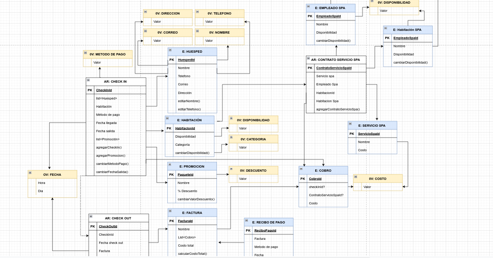

# RetoDDD

### Contextualización:

#### Se aplica el modelo DDD (Domain-Driven Desing) a un hotel, que además del servicio de hospedaje, es famoso por  el servicio de spa ofrecido adicionalmente a sus clientes. Con una amplia variedad de paquetes.
#### A continuación se presenta el modelo de dominio.
#### El modelo completo se encuentra en el siguiente link:

#### https://drive.google.com/file/d/163mP1e9kPDGUIF5XytnNpXrv13WJshoh/view?usp=sharing

### Modelo de Dominio:

#### A continuación se presenta el modelo de Dominio en el que se identifican tres agregados:
#### 1) Check in
#### 2) Check out
#### 3) Contratación servicio Spa

### Casos de uso disparados por eventos:
#### Se crean dos casos de uso disparados por eventos:
#### 1) Se actualiza la disponibilidad habitación hotel dispara por el evento checkIn creado
#### 2) Se actualiza disponibilidad habitación disparada por el evento checkOut creado
