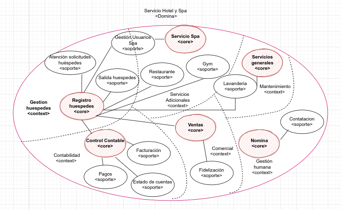
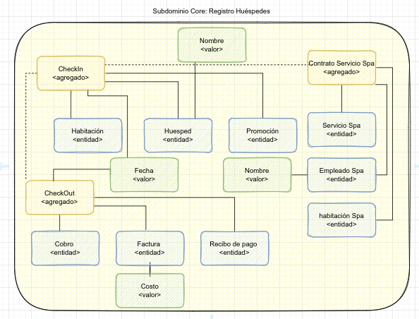
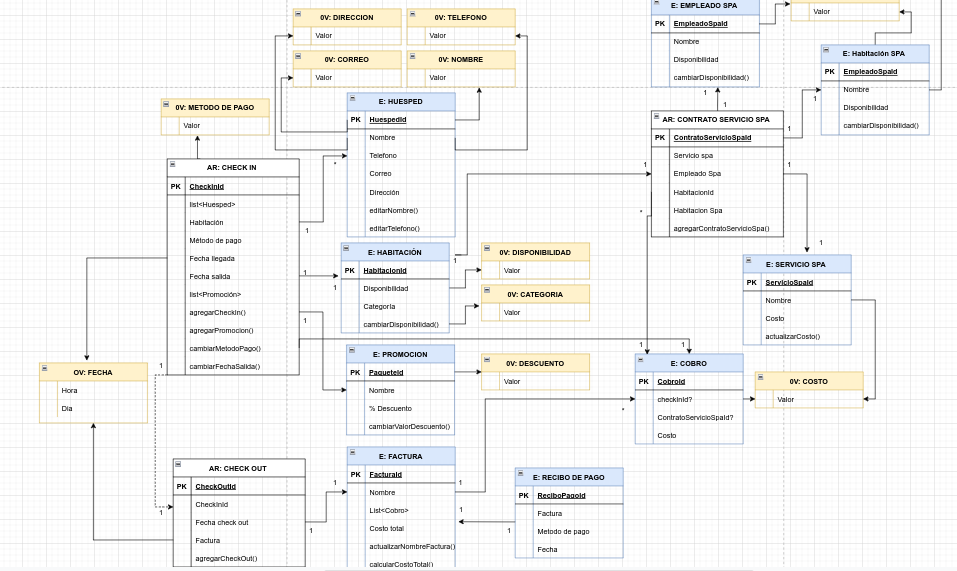
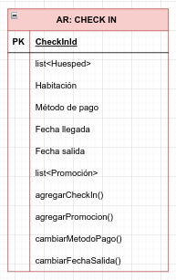
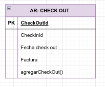
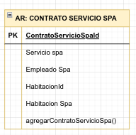

# RetoDDD

### Contextualización:

#### Se aplica el modelo DDD (Domain-Driven Desing) a un hotel, que además del servicio de hospedaje, es famoso por  el servicio de spa ofrecido adicionalmente a sus clientes. Con una amplia variedad de paquetes.
#### A continuación se presenta el modelo de dominio.
#### El modelo completo se encuentra en el siguiente link:

#### https://drive.google.com/file/d/163mP1e9kPDGUIF5XytnNpXrv13WJshoh/view?usp=sharing

### Subdominio Core:
#### Registro Huéspedes

### Modelo de Dominio:

#### A continuación se presenta el modelo de Dominio en el que se identifican tres agregados:
#### Check in
#### Check out
#### Contratación servicio Spa

#### El plan estratégico del hotel como empresa está centrado en el incremento de clientes registrados, de tal manera que se busca que cada uno de los procesos internos estén alineados a su estrategia de negocio.

#### 1) Check in

#### El agregado CheckIn se encuentra compuesto por una lista de clientes que se hospedarán en una habitación, método de pago, fecha de llegada que corresponde a la fecha actual del CheckIn, una presunta fecha de salida y la opción de agregar un paquete promocional.
#### #### 2) Check out

#### El agregado CheckOut recibe la información del CheckIn, fecha en la que se realiza el checkOut y  una factura que contiene una lista de costos.
#### Los costos vienen del cobro por el hospedaje y cobro si se adquiere el servicio de spa.
#### La factura puede venir a nombre de una o varias de las personas registradas en el checkIn o a nombre de una empresa.

#### Contratación servicio Spa

#### El agregado contrato servicio spa se encuentra compuesto por un servicio spa, un empleado asignado que prestará el servicio de spa, una habitación donde se prestará el servicio y una habitación de hotel donde se encuentra hospedado el cliente que tomará el servicio de spa.

### Casos de uso disparados por eventos:
#### Se crean dos casos de uso disparados por eventos:
#### 1) Se actualiza la disponibilidad habitación hotel dispara por el evento checkIn creado
#### 2) Se actualiza disponibilidad habitación disparada por el evento checkOut creado
